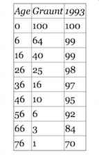

# Source of Data



## Data Input
      
* Graunt's Life Table

```{r, graunt data input}
rm(list = ls())
graunt <- data.frame(x = c(0, seq(6, 76, by = 10)), lx.17th = c(100, 64, 40, 25, 16, 10, 6, 3, 1))
```

### More data

* US 1993 life table for the same age group

```{r, us93 data input}
us.93 <- data.frame(x = graunt$x, lx.93 = c(100, 99, 99, 98, 97, 95, 92, 84, 70))
```

### Data Extraction

There are many ways to extract part of `us.93` data frame. 

```{r, extraction}
us.93["lx.93"]
us.93["lx.93"][[1]]
us.93["lx.93"]$lx.93
us.93["lx.93"]$lx
us.93[2]
us.93[2][[1]]
us.93[2]$lx.93
us.93[, "lx.93"]
us.93[, 2]
us.93$lx.93
us.93$lx
```

### Into one single data frame 

Combine two data frames into one single data frame

```{r one data frmae}
(graunt.us <- data.frame(graunt, lx.93 = us.93$lx))
```

### Life Expectancy

The basic principle is that the area under the survival function is the life expectancy. 

$X \ge 0$, $X \sim F(x)$ => $X \equiv F^{-1}(U), U \sim U(0,1)$, therefore, 

$E(X) = E\{F^{-1}(U)\} = \int_{0}^{1} F^{-1}(u)du = \int_0^{\infty} 1-F(x) dx = \int_{0}^{\infty} S(x) dx$

# Step by step approach to draw survival function plot

1. Basic plot with points and lines, compare the following threes methods

```{r, first plot, fig.width = 9, fig.height = 9}
# library(extrafont)
par(mfrow = c(2, 2))
plot(graunt$x, graunt$lx)
plot(lx.17th ~ x, data = graunt)
plot(graunt)
plot(graunt, ann = FALSE, xaxt = "n", yaxt = "n", type = "b")
```

2. Denote the ages and observed survival rates on the axes

```{r, axes labels,  fig.width = 6, fig.height = 6}
plot(graunt, ann = FALSE, xaxt = "n", yaxt = "n", type = "b")
axis(side = 1, at = graunt$x, labels = graunt$x)
axis(side = 2, at = graunt$lx.17th, labels = graunt$lx.17th)
```

3. Denote the age 0 and 76 by dotted lines

```{r, age 0 and 76, fig.width = 6, fig.height = 6}
plot(graunt, ann = FALSE, xaxt = "n", yaxt = "n", type = "b")
axis(side = 1, at=graunt$x, labels=graunt$x)
axis(side = 2, at = graunt$lx.17th, labels = graunt$lx.17th)
abline(v = c(0, 76), lty = 2)
```

### Setting up coordinates for `polygon()` (Clockwise)

```{r, polygon coordinates}
(graunt.x <- c(graunt$x, 0))
(graunt.y <- c(graunt$lx.17th, 0))
graunt.poly <- data.frame(x = graunt.x, y = graunt.y)
```

4. Shading

```{r, shading polygon, fig.width = 6, fig.height = 6}
plot(graunt, ann = FALSE, xaxt = "n", yaxt = "n", type = "b")
axis(side = 1, at = graunt$x, labels = graunt$x)
axis(side = 2, at = graunt$lx.17th, labels = graunt$lx.17th)
abline(v = c(0, 76), lty = 4)
polygon(graunt.poly, density = 15, angle = 135)
# polygon(graunt.x, graunt.y, density = 15, angle = 135)
points(graunt, pch = 21, col = "black", bg = "white")
```

5. Grids

```{r, grids, fig.width = 6, fig.height = 6}
plot(graunt, ann = FALSE, xaxt = "n", yaxt = "n", type = "b")
axis(side = 1, at = graunt$x, labels = graunt$x)
axis(side = 2, at = graunt$lx.17th, labels = graunt$lx.17th)
abline(v = c(0, 76), lty = 2)
polygon(graunt.poly, density = 15)
# polygon(graunt.x, graunt.y, density = 15)
abline(v = graunt$x, lty = 2)
points(graunt, pch = 21, col = "black", bg = "white")
```

6. Title, x-axis label, and y-axis label

```{r, title axis labels, fig.width = 6, fig.height = 6}
plot(graunt, ann = FALSE, xaxt = "n", yaxt = "n", type = "b")
axis(side = 1, at = graunt$x, labels = graunt$x)
axis(side = 2, at = graunt$lx.17th, labels = graunt$lx.17th)
abline(v = c(0, 76), lty = 2)
polygon(graunt.poly, density = 15)
# polygon(graunt.x, graunt.y, density = 15)
abline(v = graunt$x, lty = 2)
points(graunt, pch = 21, col = "black", bg = "white")
main.title <- "Graunt's Survival Function"
x.lab <- "Age (years)"
y.lab <- "Survival Rates (%)"
title(main = main.title, xlab = x.lab, ylab = y.lab)
```

### Area under the curve

The area under the curve can be approximated by the sum of the areas of trapezoids, therefore the area is $\sum_{i=1}^{n-1} (x_{i+1}-x_i)\times\frac{1}{2}(y_i + y_{i+1})$.

*  `diff()`, `head()`, and `tail()` can be used to write a function to compute the area easily.  

```{r, area function}
area.R <- function(x, y) {
  sum(diff(x) * (head(y, -1) + tail(y, -1))/2)
  }
area.R(graunt$x, graunt$lx.17th)/100
```

## Comparison with US 1993 life table

The shaded area between the survival functions of Graunt's and US 1993 represents the difference of life expectancies.

1. Draw Graunt's first with axes, lower and upper limits
    
```{r, Graunt first, fig.width = 6, fig.height = 6}
plot(graunt, ann = FALSE, xaxt = "n", yaxt = "n", type = "b")
axis(side = 1, at = graunt$x, labels = graunt$x)
axis(side = 2, at = graunt$lx, labels = graunt$lx.17th)
abline(v = c(0, 76), lty = 2)
```

2. Add US 1993 survival function

```{r, us93 added, fig.width = 6, fig.height = 6}
plot(graunt, ann = FALSE, xaxt = "n", yaxt = "n", type = "b")
axis(side = 1, at = graunt$x, labels = graunt$x)
axis(side = 2, at = graunt$lx, labels = graunt$lx.17th)
abline(v = c(0, 76), lty = 2)
lines(us.93, type = "b")
```

3. Actually, US 1993 life table is truncated at the age 76. Specify that point.

```{r, rate 70 at age 76,  fig.width = 6, fig.height = 6}
plot(graunt, ann = FALSE, xaxt = "n", yaxt = "n", type = "b")
axis(side = 1, at = graunt$x, labels = graunt$x)
axis(side = 2, at = graunt$lx, labels = graunt$lx.17th)
abline(v = c(0, 76), lty = 2)
lines(us.93, type = "b")
abline(h = 70, lty = 2)
```

4. Using `las = 1` to specify 70%.

```{r, las, fig.width = 6, fig.height = 6}
plot(graunt, ann = FALSE, xaxt = "n", yaxt = "n", type = "b")
axis(side = 1, at = graunt$x, labels = graunt$x)
axis(side = 2, at = graunt$lx, labels = graunt$lx.17th)
abline(v = c(0, 76), lty = 2)
lines(us.93, type = "b")
abline(h = 70, lty = 2)
axis(side = 2, at = 70, labels = 70, las = 1)
```

### Setting coordinates for `polygon()`

```{r, polygon coordinates us 93 added}
us.graunt.x <- c(us.93$x, rev(graunt$x))
us.graunt.y <- c(us.93$lx.93, rev(graunt$lx.17th))
us.graunt <- data.frame(x = us.graunt.x, y = us.graunt.y)
```

5. Shading 

```{r, shading between, fig.width = 6, fig.height = 6}
plot(graunt, ann = FALSE, xaxt = "n", yaxt = "n", type = "b")
axis(side = 1, at = graunt$x, labels = graunt$x)
axis(side = 2, at = graunt$lx, labels = graunt$lx.17th)
abline(v = c(0, 76), lty = 2)
lines(us.93, type = "b")
abline(h = 70, lty = 2)
axis(side = 2, at = 70, labels = 70, las = 1)
polygon(us.graunt, density = 15, col = "red", border = NA)
# polygon(us.graunt.x, us.graunt.y, density = 15, col = "red", border = NA)
points(us.graunt, pch = 21, col = "black", bg = "white")
```

6. Grids

```{r, grids for clarity, fig.width = 6, fig.height = 6}
plot(graunt, ann = FALSE, xaxt = "n", yaxt = "n", type = "b")
axis(side = 1, at = graunt$x, labels = graunt$x)
axis(side = 2, at = graunt$lx, labels = graunt$lx.17th)
abline(v = c(0, 76), lty = 2)
lines(us.93, type = "b")
abline(h = 70, lty = 2)
axis(side = 2, at = 70, labels = 70, las = 1)
polygon(us.graunt, density = 15, col = "red", border = NA)
abline(v = graunt$x, lty = 2)
points(us.graunt, pch = 21, col = "black", bg = "white")
```

7. Title, x-axis and y-axis labels

```{r, title-axis-labels, fig.width = 6, fig.height = 6}
plot(graunt, ann = FALSE, xaxt = "n", yaxt = "n", type = "b")
axis(side = 1, at = graunt$x, labels = graunt$x)
axis(side = 2, at = graunt$lx, labels = graunt$lx.17th)
abline(v = c(0, 76), lty = 2)
lines(us.93, type = "b")
abline(h = 70, lty = 2)
axis(side = 2, at = 70, labels = 70, las = 1)
polygon(us.graunt, density = 15, col = "red", border = NA)
abline(v = graunt$x, lty = 2)
points(us.graunt, pch = 21, col = "black", bg = "white")
main.title.g.us <- "Survival Function of Graunt and US 1993"
title(main = main.title.g.us, xlab = x.lab, ylab = y.lab)
dev.copy(device = png, file = "../pics/graunt_us93.png")
```

### Life expectancy

The area under the US 1993 survival function is

```{r, area us 93} 
area.R(us.93$x, us.93$lx.93)/100
``` 

The area of shaded region is

```{r, difference in area}
area.R(us.93$x, us.93$lx.93)/100 - area.R(graunt$x, graunt$lx.17th)/100
```

# Comparison with Halley's life table

## Halley's life table

```{r, Halley lifetable}
age <- 0:84
lx <- c(1238, 1000, 855, 798, 760, 732, 710, 692, 680, 670, 661, 653, 646, 640, 634, 628, 622, 616, 610, 604, 598, 592, 586, 579, 573, 567, 560, 553, 546, 539, 531, 523, 515, 507, 499, 490, 481, 472, 463, 454, 445, 436, 427, 417, 407, 397, 387, 377, 367, 357, 346, 335, 324, 313, 302, 292, 282, 272, 262, 252, 242, 232, 222, 212, 202, 192, 182, 172, 162, 152, 142, 131, 120, 109, 98, 88, 78, 68, 58, 50, 41, 34, 28, 23, 20)
length(lx)
halley <- data.frame(age, lx)
halley$px <- round(halley$lx/1238*100, digits = 1)
head(halley)
tail(halley)
halley.lx <- halley[-3]
halley <- halley[-2]
head(halley)
tail(halley)
```

## R base graphics

To make the comparison easy, plot the points at the same age group of Graunt's,  `r graunt$x`. Step by step approach

1. Halley's survival function first     

```{r, Halley first, fig.width = 6, fig.height = 6}
plot(halley, ann = FALSE, xaxt = "n", yaxt = "n", type = "l")
```

2. Denote the age at 0, 76, and 84 by vertical dotted lines

```{r, age limits, fig.width = 6, fig.height = 6}
plot(halley, ann = FALSE, xaxt = "n", yaxt = "n", type = "l")
abline(v = c(0, 76, 84), lty = 2)
```


3. Mark the points at `r graunt$x` on Halley's survival function.
    
```{r, Halley with Graunt age, fig.width = 6, fig.height = 6}
age.graunt <- age %in% graunt$x
plot(px ~ age, data = halley, ann = FALSE, xaxt = "n", yaxt = "n", type = "l")
abline(v = c(0, 76, 84), lty = 2)
points(px[age.graunt] ~ age[age.graunt], data = halley, pch = 21, col = "black", bg = "white")
```

### Using `subset()`

```{r, with subset, fig.width = 6, fig.height = 6}
halley.graunt <- subset(halley, age.graunt)
plot(halley, ann = FALSE, xaxt = "n", yaxt = "n", type = "l")
abline(v = c(0, 76, 84), lty = 2)
points(halley.graunt, pch = 21, col = "black", bg = "white")
```

4. Add Graunt's survival function
    
```{r, Graunt added, fig.width = 6, fig.height = 6}
plot(halley, ann = FALSE, xaxt = "n", yaxt = "n", type = "l")
abline(v = c(0, 76, 84), lty = 2)
points(halley.graunt, pch = 21, col = "black", bg = "white")
lines(graunt, type = "b", pch = 21, col = "black", bg = "white")
```

5. x-axis label and y-axis label with `las = 1`
    
```{r, labels, fig.width = 6, fig.height = 6}
plot(halley, ann = FALSE, xaxt = "n", yaxt = "n", type = "l")
abline(v = c(0, 76, 84), lty = 2)
points(halley.graunt, pch = 21, col = "black", bg = "white")
lines(graunt, type = "b", pch = 21, col = "black", bg = "white")
axis(side = 1, at = c(graunt$x, 84), labels = c(graunt$x, 84))
axis(side = 2, at = graunt$lx.17th, labels = graunt$lx.17th, las = 1)
```

6. Specify the developers at proper coordinates with `text()`

```{r fig.width = 6, fig.height = 6}

plot(halley, ann = FALSE, xaxt = "n", yaxt = "n", type = "l")
abline(v = c(0, 76, 84), lty = 2)
points(halley.graunt, pch = 21, col = "black", bg = "white")
lines(graunt, type = "b", pch = 21, col = "black", bg = "white")
axis(side = 1, at = c(graunt$x, 84), labels = c(graunt$x, 84))
axis(side = 2, at = graunt$lx.17th, labels = graunt$lx.17th, las = 1)
text(x = c(16, 36), y = c(20, 50), label = c("Graunt", "Halley"))
```

7. Main title, x-axis label, and y-axis label
    
```{r, title and labels, fig.width = 6, fig.height = 6}
plot(halley, ann = FALSE, xaxt = "n", yaxt = "n", type = "l")
abline(v = c(0, 76, 84), lty = 2)
points(halley.graunt, pch = 21, col = "black", bg = "white")
lines(graunt, type = "b", pch = 21, col = "black", bg = "white")
axis(side = 1, at = c(graunt$x, 84), labels = c(graunt$x, 84))
axis(side = 2, at = graunt$lx.17th, labels = graunt$lx.17th, las = 1)
text(x = c(16, 36), y = c(20, 50), label = c("Graunt", "Halley"))
main.title.2 <- "Survival Function of Graunt and Halley"
title(main = main.title.2, xlab = x.lab, ylab = y.lab)
```

## Polygon

Setting the coordinates for `polygon()`. The intersection is found at `x = 10.8, y = 52.8` with `locator(1)` and couple of trial and errors.

* Upper region

```{r, coords upper region}
poly.1.x <- c(graunt$x[1:2], 10.8, halley$age[11:1])
poly.1.y <- c(graunt$lx.17th[1:2], 52.8, halley$px[11:1])
poly.upper <- data.frame(x = poly.1.x, y = poly.1.y)
```

* Lower region

```{r, coords lower region}
poly.2.x <- c(10.8, halley$age[12:85], graunt$x[9:3])
poly.2.y <- c(52.8, halley$px[12:85], graunt$lx.17th[9:3])
poly.lower <- data.frame(x = poly.2.x, y = poly.2.y)
```

8. Shading upper region first 

```{r, shading upper region, fig.width = 6, fig.height = 6}
plot(halley, ann = FALSE, xaxt = "n", yaxt = "n", type = "l")
abline(v = c(0, 76, 84), lty = 2)
points(halley.graunt, pch = 21, col = "black", bg = "white")
lines(graunt, type = "b", pch = 21, col = "black", bg = "white")
axis(side = 1, at = c(graunt$x, 84), labels = c(graunt$x, 84))
axis(side = 2, at = graunt$lx.17th, labels = graunt$lx.17th, las = 1)
text(x = c(16, 36), y = c(20, 50), label = c("Graunt", "Halley"))
title(main = main.title.2, xlab = x.lab, ylab = y.lab)
polygon(poly.upper, angle = 45, density = 15, col = "blue")
```

9. Shading lower region next 

```{r, shading lower region, fig.width = 6, fig.height = 6}
plot(halley, ann = FALSE, xaxt = "n", yaxt = "n", type = "l")
abline(v = c(0, 76, 84), lty = 2)
points(halley.graunt, pch = 21, col = "black", bg = "white")
lines(graunt, type = "b", pch = 21, col = "black", bg = "white")
axis(side = 1, at = c(graunt$x, 84), labels = c(graunt$x, 84))
axis(side = 2, at = graunt$lx.17th, labels = graunt$lx.17th, las = 1)
text(x = c(16, 36), y = c(20, 50), label = c("Graunt", "Halley"))
title(main = main.title.2, xlab = x.lab, ylab = y.lab)
polygon(poly.upper, angle = 45, density = 15, col = "blue")
polygon(poly.lower, angle = 45, density = 15, col = "red")
```

10. Fill the points. Extra points at the 84. 

```{r, fill the points, fig.width = 6, fig.height = 6}
plot(halley, ann = FALSE, xaxt = "n", yaxt = "n", type = "l")
abline(v = c(0, 76, 84), lty = 2)
points(halley.graunt, pch = 21, col = "black", bg = "white")
lines(graunt, type = "b", pch = 21, col = "black", bg = "white")
axis(side = 1, at = c(graunt$x, 84), labels = c(graunt$x, 84))
axis(side = 2, at = graunt$lx.17th, labels = graunt$lx.17th, las = 1)
text(x = c(16, 36), y = c(20, 50), label = c("Graunt", "Halley"))
title(main = main.title.2, xlab = x.lab, ylab = y.lab)
polygon(poly.upper, angle = 45, density = 15, col = "blue")
polygon(poly.lower, angle = 45, density = 15, col = "red")
points(graunt, pch = 21, col = "black", bg = "white")
points(halley.graunt, pch = 21, col = "black", bg = "white")
points(x = 84, y = halley$px[85], pch = 21, col = "black", bg = "white")
dev.copy(device = png, file = "../pics/graunt_halley.png")
```

### Life expectancy

Compute the difference of life expectancies

```{r, life expectancy comparison}
(life.exp.halley <- area.R(halley$age, halley$px)/100)
(life.exp.graunt <- area.R(graunt$x, graunt$lx.17th)/100)
```

## ggplot 

```{r, library ggplot2}
library(ggplot2)
```

### Data Reshape

Attach `reshape2` package to change wide format to long format

```{r, reshape2}
library(reshape2)
```

How `melt()` works

```{r, format of melt}
graunt.us.melt <- melt(graunt.us, id.vars = "x", measure.vars = c("lx.17th", "lx.93"), value.name = "lx", variable.name = "times")
graunt.us.melt
str(graunt.us.melt)
```

* Change factor levels of `times`

```{r, factor level}
levels(graunt.us.melt$times) <- c("17th", "1993")
str(graunt.us.melt)
```

## Plot

### Points and Lines

Step by step approach to understand the grammar of ggplot

* We set `ggplot()` to accept varying `data.frame()` and `aes()`in `geom_polygon`

```{r, geom_point geom_line, fig.width = 6, fig.height = 6}
(g1 <- ggplot() + 
<<<<<<< HEAD
  geom_point(data = graunt.us.melt, aes(x = x, y = lx, colour = times)))
(g2 <- g1 + 
  geom_line(data = graunt.us.melt, aes(x = x, y = lx, colour = times)))
=======
  geom_line(data = graunt.us.melt, aes(x = x, y = lx, colour = times)))
(g2 <- g1 + 
  geom_point(data = graunt.us.melt, aes(x = x, y = lx, colour = times), shape = 21, fill = "white"))
>>>>>>> upstream/master
(g3 <- g2 + 
  theme_bw()) 
```

## Polygon 

Reuse `us.graunt` which contains `x = us.graunt.x` and `y = us.graunt.y` for `polygon()`. Note that we start with `g3`, and also note how to remove default legends.

```{r, polygon, fig.width = 6, fig.height = 6}
(p3 <- g3 + 
  geom_polygon(data = us.graunt, aes(x = x, y = y), alpha = 0.3, fill = "red"))
(p4 <- p3 + 
  guides(colour = "none"))
```

## Change default annotations

### Points and Lines

1. Change the x-axis and y-axis labels
    
```{r, axis labels, fig.width = 6, fig.height = 6}
(g4 <- g3 + 
   xlab(x.lab) + 
   ylab(y.lab))
```

2. Add main title

```{r, ggtitle, fig.width = 6, fig.height = 6}
(g4 <- g3 + 
   xlab(x.lab) + 
   ylab(y.lab) + 
   ggtitle(main.title.g.us))
```

3. Change legend title
    
```{r, legends title, fig.width = 6, fig.height = 6}
(g4 <- g3 + 
   xlab(x.lab) + 
   ylab(y.lab) + 
   ggtitle(main.title.g.us) +
   labs(colour = "Era"))
```

4. Change legends.
    
```{r, change legends, fig.width = 6, fig.height = 6}
(g4 <- g3 + 
   xlab(x.lab) + 
   ylab(y.lab) +
   ggtitle(main.title.g.us) +
   labs(colour = "Era") +
   scale_colour_discrete(labels = c("Graunt Era", "US 1993")))
```

5. Place legends inside the plot

```{r, legends inside, fig.width = 6, fig.height = 6}
(g5 <- g4 + 
   theme(legend.position = c(0.8, 0.5)))
```

6. Change x-axis and y-axis tick marks

```{r, axis tick marks, fig.width = 6, fig.height = 6}
(g6 <- g5 + 
   scale_x_continuous(breaks = graunt$x) + scale_y_continuous(breaks = graunt$lx.17th))
ggsave("../pics/graunt_us_plot.png", g6)
```

## Polygon

Add information to the plot drawn with `polygon()`

1. Start with `p4`

```{r, start with p4, fig.width = 6, fig.height = 6}
p4
```

2. Main title, x-axis and y-axis labels

```{r, title and axis labels,  fig.width = 6, fig.height = 6}
(p5 <- p4 + 
   xlab(x.lab) + 
   ylab(y.lab) +
   ggtitle(main.title.g.us))
```

3. `"Graunt Era"`, `"US 1993"`, `"Difference of Life Expectancies"` at proper positions
    
```{r, text polygon,  fig.width = 6, fig.height = 6}
(p6 <- p5 + 
   annotate("text", x = c(20, 40, 70), y = c(20, 60, 90), label = c("Graunt Era", "Difference of\nLife Expectancies", "US 1993"), family = "Helvetica"))
```

4. x-axis and y-axis tick marks

```{r, familiar axis labels, fig.width = 6, fig.height = 6}
(p7 <- p6 + 
   scale_x_continuous(breaks = graunt$x) + scale_y_continuous(breaks = graunt$lx.17th))
ggsave("../pics/graunt_us_poly.png", p7)
```

# Graunt and Halley

### Data Reshaping

Since the observed ages are different, we need final structure of the data frame to be melted. So, create copies of `graunt` and `halley` and extract parts of what we need and give feasible names.  

```{r, data reshaping}
graunt.2 <- graunt
halley.2 <- halley
names(graunt.2) <- c("x", "Graunt")
names(halley.2) <- c("x", "Halley")
graunt.halley.melt <- melt(list(graunt.2, halley.2), id.vars = "x", value.name = "lx", variable.name = "Who")
str(graunt.halley.melt)
graunt.halley.melt <- graunt.halley.melt[-4]
(graunt.halley.melt.g <- subset(graunt.halley.melt, graunt.halley.melt$x %in% graunt$x))
```
 
## Survival Function, Step by Step

```{r, first plot for Graunt and Halley, fig.width = 6, fig.height = 6}
(gh1 <- ggplot() + 
  geom_line(data = graunt.halley.melt, aes(x = x, y = lx, colour = Who)))
(gh2 <- gh1 + 
<<<<<<< HEAD
  geom_point(data = graunt.halley.melt.g, aes(x = x, y = lx, colour = Who)))
=======
  geom_point(data = graunt.halley.melt.g, aes(x = x, y = lx, colour = Who), shape = 21, fill = "white"))
>>>>>>> upstream/master
(gh3 <- gh2 + 
  theme_bw() + 
  xlab(x.lab) + 
  ylab(y.lab) + 
  ggtitle(main.title.2))
(gh4 <- gh3 + 
  theme(legend.position = c(0.8, 0.8)) +
  annotate("text", x = c(16, 36), y = c(20, 50), label = c("Graunt", "Halley")) +
  scale_x_continuous(breaks = c(graunt$x, 84)) + 
  scale_y_continuous(breaks = c(graunt$lx.17th, halley$px[halley$age == 6])))
ggsave("../pics/graunt_halley_ggplot.png", gh4)
```

## Polygon

Reuse `poly.upper` data frame and `poly.lower` data frame.

```{r, polygon for Graunt and Halley, fig.width = 6, fig.height = 6}
(ghp4 <- gh4 + 
<<<<<<< HEAD
  geom_polygon(data = poly.upper, aes(x = x, y = y), alpha = 0.3, fill = "blue"))
(ghp5 <- ghp4 + 
  geom_polygon(data = poly.lower, aes(x = x, y = y), alpha = 0.3, fill = "red"))
(ghp5 <- ghp5 +
  geom_point(data = data.frame(x = 84, y = halley$px[85]), aes(x = x, y = y),  colour = 3))
=======
  geom_polygon(data = poly.upper, aes(x = x, y = y), alpha = 0.3, fill = "red"))
(ghp5 <- ghp4 + 
  geom_polygon(data = poly.lower, aes(x = x, y = y), alpha = 0.3, fill = "green"))
(ghp5 <- ghp5 +
  geom_point(data = data.frame(x = 84, y = halley$px[85]), aes(x = x, y = y),  colour = 3, shape = 21, fill = "white"))
>>>>>>> upstream/master
ggsave("../pics/graunt_halley_poly_ggplot.png", ghp5)
```

# Graunt, Halley, and US93

## Data Reshape

```{r, reshape stage 3}
us93.2 <- us.93
names(us93.2) <- c("x", "US93")
ghu.melt <- melt(list(graunt.2, halley.2, us93.2), id.vars = "x", value.name = "lx", variable.name = "Who")
ghu.melt.g <- ghu.melt[ghu.melt$x %in% graunt$x, ]
main.title.3 <- "Survival Function Plots"
```

## Survival Function Plots with ggplot

```{r, Survival function plot for Graunt Halley and US93, fig.width = 6, fig.height = 6}
(ghu1 <- ggplot() + 
  geom_line(data = ghu.melt, aes(x = x, y = lx, colour = Who)))
(ghu2 <- ghu1 + 
<<<<<<< HEAD
  geom_point(data = ghu.melt.g, aes(x = x, y = lx, colour = Who)))
=======
  geom_point(data = ghu.melt.g, aes(x = x, y = lx, colour = Who), shape = 21, fill = "white"))
>>>>>>> upstream/master
(ghu3 <- ghu2 + 
  theme_bw() + 
  xlab(x.lab) + 
  ylab(y.lab) + 
  ggtitle(main.title.3))
(ghu4 <- ghu3 + 
  theme(legend.position = c(0.2, 0.2)) +
  annotate("text", x = c(36, 36, 70), y = c(25, 50, 90), label = c("Graunt", "Halley", "US93")) +
  scale_x_continuous(breaks = c(graunt$x, 84)) + 
  scale_y_continuous(breaks = c(graunt$lx.17th, halley$px[halley$age == 6])))
ggsave("../pics/graunt_halley_us_ggplot.png", ghu4)
```

## Polygon

### Coordinates 

In order to make the graphs truncated at the age 76, restrict the age of Halley up to 76.

```{r, polygon data}
poly.lower.76 <- subset(poly.lower, poly.lower$x <= 76)
poly.3.x <- c(us93.2$x, halley.2$x[85:12], 10.8, graunt.2$x[2:1])
poly.3.y <- c(us93.2$US93, halley.2$Halley[85:12], 52.8, graunt.2$Graunt[2:1])
poly.us <- data.frame(x = poly.3.x, y = poly.3.y)
poly.us.76 <- subset(poly.us, poly.us$x <= 76)
```


```{r, polygon for Graunt Halley and US93, fig.width = 6, fig.height = 6}
(ghup4 <- ghu4 + 
  geom_polygon(data = poly.upper, aes(x = x, y = y), alpha = 0.3, fill = "red"))
(ghup5 <- ghup4 + 
  geom_polygon(data = poly.lower.76, aes(x = x, y = y), alpha = 0.3, fill = "green"))
(ghup6 <- ghup5 +
  geom_polygon(data = poly.us.76, aes(x = x, y = y), alpha = 0.3, fill = "blue"))
(ghup7 <- ghup6 +
<<<<<<< HEAD
  geom_point(data = data.frame(x = 84, y = halley$px[85]), aes(x = x, y = y),  colour = 3))
=======
  geom_point(data = data.frame(x = 84, y = halley$px[85]), aes(x = x, y = y),  colour = 3, shape = 21, fill = "white"))
>>>>>>> upstream/master
ggsave("../pics/graunt_halley_us_poly_ggplot.png", ghup7)
```

### dump() and source()

* Check out how to save and retrieve. Use `source()` and `load()` for retrieval.

```{r, dump and save}
dump("area.R", file = "area.R")
<<<<<<< HEAD
save.image("graunt_halley_160329.rda")
=======
save.image("graunt_halley_160329v2.rda")
>>>>>>> upstream/master
```
