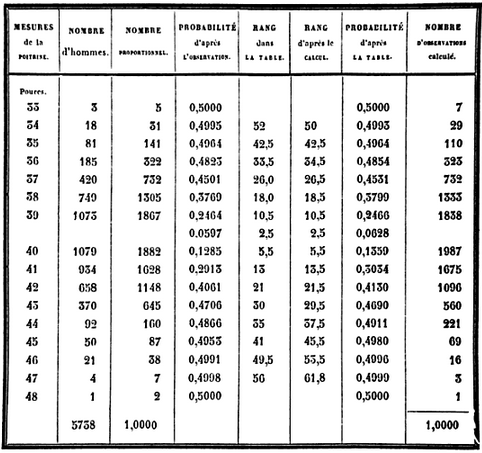

학번 ________________ 

이름 ________________

<!--### Data

#### `rn96.txt` 자료 읽어들이기

* `"../data/rn96.txt"`는 파일 경로이므로 `rn96.txt`를 다운로드받은 폴더로 지정하면 되나 가급적 `R` source 를 저장하는 폴더(예를 들어서, 폴더 `R`)와 원시 자료를 저장하는 폴더(예를 들어서, 폴더 `data`)를 구분해 두는 것이 효과적이다. 원 자료를 보고 변수명에 해당하는 `header` 매개변수를 `TRUE` 로 설정한다. `<-`는 assignment. 아래 주어진 세 가지 표현은 모두 동일한 결과를 가져온다.

```{r, read.table}
rn96 <- read.table("../data/rn96.txt", header = TRUE)
rn96
(rn96.2 <- read.table("../data/rn96.txt", header = TRUE))
assign("rn96.3", read.table("../data/rn96.txt", header = TRUE))
rn96.3
```

* `str()`은 자료의 구조를 살피는 함수이며, value는 없다. `rn96` 의 자료구조를 살펴보면,  `int`(integer) class가 나온다. 정수이지만 사칙 연산에는 아무런 영향이 없다.

* `sapply()`는 `rn96`의 각 변수에 `mode()` 또는 `class()`를 적용한다.

```{r, str}
str(rn96)
sapply(rn96, mode)
sapply(rn96, class)
```

### Summary Statistics

* `height` 와 `weight` 의 기초통계 살피기

```{r, summary}
summary(rn96)
```

* 평균과 표준편차를 각 변수별로 살펴보려면 `apply()`를 이용한다. 이 때 `options(digits = 2)`가 없으면 출력결과가 어떻게 달라지는지 살펴보자. 출력 결과에 이름을 붙이는 방법을 보여주고 있다. `height`와 `weight`를 불러들이는 방법에 유의하자. 이는 `str(rn96)`의 결과로부터 생각할 수 있는 것으로서 `rn96`을 `list`로도 볼 수 있기 때문이다. 

```{r, mean and SD}
options("digits")
options(digits = 2)
apply(rn96, 2, mean)
apply(rn96, 2, sd)
c(mean(rn96$height), sd(rn96$height))
c(mean(rn96$weight), sd(rn96$weight))
c(Mean = mean(rn96$height), SD = sd(rn96$height))
c(Mean = mean(rn96$weight), SD = sd(rn96$weight))
options(digits = 7)
```


### Base Graphics

#### `height` 와 `weight` 의 산점도 그리기. --> 

<!--
* `x`축에 독립변수로 들어가는 변수와 `y`축에 들어가는 종속변수를 설정하는 여러가지 방법이 있음을 알 수 있다. 동일한 `plot()`이지만 출력 결과에서 default로 나오는 각 축의 label 값이 서로 다름을 알 수 있다. 맨 마지막 방법에 유의하라.
-->
<!--
* 출력결과에서 도표의 크기는 `par()`에서 조정할 수도 있고, R Studio의 R markdown 에서 조정할 수도 있다. Graphic 수업에서 보다 자세히 다룰 예정이다.
-->

----

----

### BMI

(@) 다음 중 `plot(rn96$height, rn96$weight)` 의 결과로 적합한 것은 무엇인가?

```{r, Scatter Diagram, fig.width = 9, fig.height = 9, echo = FALSE}
par(family = "AppleGothic")
par(mfrow = c(2, 2))
plot(weight ~ height, data = rn96, main = "가.")
plot(rn96$height, rn96$weight, main = "나.")
plot(rn96[, 1], rn96[, 2], main = "다.")
plot(rn96, main = "라.")
```

----

<!--#### 선형회귀선 추가하기. 

* 선형모형으로 적합하는 `lm()`의 결과물을 활용하고 있다.
-->

(@) 다음 산점도에 회귀선을 그리는 데 적합한 것은 무엇인가?

    가. `lines(lm(weight ~ height, data = rn96)$coefficient)`

    나. `points(lm(weight ~ height, data = rn96)$coefficient)`

    다. `abline(lm(weight ~ height, data = rn96)$coefficient)`

    라. `polygon(lm(weight ~ height, data = rn96)$coefficient)`

```{r, regression lines, fig.width = 3.8, fig.height = 3.8, echo = FALSE}
plot(weight ~ height, data = rn96)
abline(lm(weight ~ height, data = rn96)$coefficient)
```

<!--* 선형모형으로 분석하기 위하여 별도의 `R` 오브젝트로 저장한다.

```{r, regression models}
rn96.lm <- lm(weight ~ height, data = rn96)
```

#### 회귀계수와 관련 통계량 살피기. 

* `summary()`를 이용하여 선형모형 분석에 등장하는 각종 통계를 살펴볼 수 있다.

```{r, regression coefficients}
summary(rn96.lm)
```

* 1차 회귀식으로는 살피기 힘든 국소적인 변화를 살피기 위하여 `lowess()`를 이용한 local smoother를 추가한다.
-->

(@) 1차 회귀식으로는 살피기 힘든 국소적인 변화를 살피기 위하여 붉은 색으로 local smoother를 추가한다. 이 때 적합한 것은?

    가. `lines(lowess(rn96$height, rn96$weight), col = "red")`

    나. `points(lowess(rn96$height, rn96$weight), col = "red")`

    다. `abline(lowess(rn96$height, rn96$weight), col = "red")`

    라. `polygon(lowess(rn96$height, rn96$weight), col = "red")`

<!--
```{r, lowess, fig.width = 4.5, fig.height = 4.5, echo = FALSE}
plot(weight ~ height, data = rn96)
abline(lm(weight ~ height, data = rn96)$coefficient)
lines(lowess(rn96$height, rn96$weight), col = "red")
```
-->

<!--### BMI 계산하고 줄기-잎 그리기

* 조금 편하게 작업하기 위해서 `height`와 `weight`를 별도의 R object로 복사하여 사용하자. 우선, `height`와 `weight`를 불러내는 방법이 다음과 같이 다양하다는 점을 기억해 두자.
-->
<!--
(@) 다음 중 그 결과가 다른 것 하나를 고르시오.

    가. `rn96$height`
    
    나. `rn96[, 1]`
    
    다. `rn96[, "height"]`
    
    라. `rn96["height"]`
-->
<!--
```{r, subscrpting}
rn96$height
str(rn96$height)
rn96[, 1]
str(rn96[, 1])
rn96[, "height"]
str(rn96[, "height"])
rn96["height"]
str(rn96["height"])
rn96[1]
str(rn96[1])
```

```{r, assignment}
height <- rn96$height
weight <- rn96$weight
```

#### BMI 계산

* 체질량지수라고 알려져 있는 BMI(Body Mass Index) 공식은 $\frac{몸무게(kg)}{키^2(m)}$로 주어진다. 이는 벨기에의 수학자, 천문학자이자 사회통계학자로 알려져 있는 아돌프 케틀레의 업적 중 하나이다. 아래 계산에서 `round()`를 씌우지 않으면 어떤 출력이 나오는지 살펴 보고, `digits = ` 를 바꿔 가며 결과를 비교해 보자. 위에서 `options(digits = 2)`라고 설정했을 때 와의 차이를 생각해 보자.

* `rn96`에 BMI 계산 결과를 합쳐 보기 위해서 `cbind()`(column끼리 묶는다)를 사용하였다. 키, 몸무게, BMI가 모두 숫자변수이기 때문에 가능하다. 

* `head()`, `tail()`은 괄호 안에 들어가는 자료의 첫 6개와 끝 6개를 보여준다. 갯수를 조정하려면 `n = ` 매개변수를 사용한다.  

```{r, BMI computation}
(BMI <- weight/(height / 100)^2)
(BMI <- round(weight/(height/100)^2, digits=1))
head(cbind(rn96, BMI))
tail(cbind(rn96, BMI), n = 10)
```

#### BMI 값들의 줄기-잎 그림 그리기

* John W. Tukey의 수많은 업적 중의 하나인 줄기-잎 그림은 자료의 윤곽 뿐 아니라 개별 값도 함께 파악할 수 있는 유용한 도구이다. R에서는 `stem()`이라는 함수로 계산한다. 많이 쓰이는 매개변수로는 `scale = `이 있다.

```{r, stem and leaf plot for BMI}
stem(BMI)
stem(BMI, scale=2)
```

- `weight`와 `height`의 줄기-잎 그림

```{r, stem and leaf plots for height and weight}
stem(height)
stem(weight)
```

#### BMI를 토대로 한 비만도 판정
-->

(@) BMI 를 토대로 한 비만도 판정은 "18.5 미만은 underweight, 18.5 ~ 24.9 는 Normal, 25 ~ 29.9 는 Overweight, 30 이상은 Obese" 이다.
이 때, `rn96` 에 판정결과를 덧붙이기 위하여 작성한 다음 코드에서 괄호 자리에 적당한 R 함수는 무엇인가?
     
    가. `ifelse`
    
    나. `if`
    
    다. `for`
    
    라. `while`

```
rn96$BMI <- BMI
(rn96$obesity <- (      )(BMI < 18.5, "Underweight", (      )(BMI >= 18.5 & BMI < 24.9, "Normal", (     )(BMI >= 25 & BMI < 29.9, "Overweight", "Obese"))))
```

<!--#### 정규성(normality) 살펴보기

* `qqnorm()`을 이용하여 각 변수가 정규분포에 가까운지 시각적으로 살펴보자.

```{r, qqnorm,  fig.width=5, fig.height=5}
qqnorm(weight)
qqnorm(height)
qqnorm(BMI)
```

### 작업 폴더 정리하기

* `save()` 를 이용하면 작업 디렉토리에서 꼭 필요한 객체들만 모아서 저장해 놓을 수 있고, `save.image()`를 이용하면 현재 작업 디렉토리에 있는 모든 객체를 저장하게 된다. 불러들일 때는 `load()`를 이용한다. `rm()`은 현재 디렉토리에 있는 객체 중에 삭제하고 싶은 것을 골라서 삭제하는 기능을 갖는다. 당연히 사용할 때 주의하여야 한다. 저장하는 다양한 방법을 살펴보자.

* 작업 history를 저장하고 나중에서 편집해서 다시 활용하려면 `savehistory()`를 이용한다.

```{r, save and history}
ls()
save("rn96", "BMI", file = "./rn96_1.rda")
save(list = c("rn96", "BMI"), file = "./rn96_2.rda")
save(list = ls(), file = "./rn96_3.rda")
save.image(file = "./rn96_4.rda")
rm(list = ls())
ls()
load("./rn96_1.rda")
ls()
rm(list = ls())
ls()
load("./rn96_2.rda")
ls()
rm(list = ls())
ls()
load("./rn96_3.rda")
ls()
rm(list = ls())
load("./rn96_4.rda")
ls()
# savehistory(file = "./rn96.Rhistory")
```
-->

### Quetelet's Scottish Soldiers

(@) 다음과 같이 그림 파일로 저장되어 있는 자료를 불러들이는 코드로 적절한 것은? 단, 그림의 폭을 기준으로 적절히 조절하고자 한다. 

    가. ``
    
    나. ``
    
    다. ``
    
    라. ``
    
    


<!--### Frequency Table

* 케틀레가 작성한 스코틀랜드 군인 5738명의 가슴둘레(인치) 분포표를 옮기면 

```{r, data setup}
chest <- 33:48
freq <- c(3, 18, 81, 185, 420, 749, 1073, 1079, 934, 658, 370, 92, 50, 21, 4, 1)
data.frame(chest, freq)
data.frame(Chest = chest, Freq = freq)
chest.table <- data.frame(Chest = chest, Freq = freq)
chest.table
str(chest.table)
```

#### Extract Parts of an Object
-->

----

(@) 아래와 같은 구조를 가진 `chest.table`에서 `"Freq"`를 추출하는 방법 중 그 결과가 다른 것은?

    가. `chest.table$Freq`
    
    나. `chest.table[, 2]`
    
    다. `chest.table[, "Freq"]`
    
    라. `chest.table["Freq"]`


```{r, extract parts, echo = FALSE}
str(chest.table)
```

<!--
* 33인치인 사람이 3명, 34인치인 사람이 18명 등으로 기록되어 있으나 이는 구간의 가운데로 이해하여야 함.


### Probability Histogram

* `barplot(height, ...)` 은 기본적으로 `height`만 주어지면 그릴 수 있음. 확률 히스토그램의 기둥 면적의 합은 1이므로, 각 기둥의 높이는 각 계급의 돗수를 전체 돗수, `r sum(chest.table$Freq)`명으로 나눠준 값임.

```{r, barplot first, fig.width = 8, fig.height = 4.5}
total <- sum(chest.table$Freq)
barplot(chest.table$Freq/total)
```

* 각 막대의 이름은 계급을 나타내는 가슴둘레 값으로 표현할 수 있고, 막대 간의 사이를 띄우지 않으며, 디폴트 값으로 주어진 회색 보다는 차라리 백색이 나으므로 이를 설정해 주면,
-->

----

----

(@) 다음 `barplot`에서 막대 사이의 간격을 없애려면 어떤 조건을 넣어야 하는가?

    가. `names.arg = 33:48`
    
    나. `space = 0`
    
    다. `offset = 0`
    
    라. `beside = TRUE`

```{r, barplot, fig.width = 6, fig.height = 2.5, echo = FALSE}
total <- sum(chest.table$Freq)
barplot(chest.table$Freq/total)
```

<!--
```{r, barplot white, fig.width = 8, fig.height = 4.5}
barplot(chest.table$Freq/total, names.arg = 33:48, space = 0, col = "white")
``` 
-->

<!--* 확률 히스토그램의 정의에 따라 이 막대들의 면적을 합하면 1이 됨에 유의.

### Summary statistics and SD

* 33인치가 3명, 34인치가 18명 등을 한 줄의 긴 벡터로 나타내어야 평균과 표준편차를 쉽게 계산할 수 있으므로 long format으로 바꾸면,
-->

<!--
```{r, long format data frame}
chest.long <- rep(chest.table$Chest, chest.table$Freq)
str(chest.long)
```

#### `rep()`

```{r, rep()}
rep(1:3, 3)
rep(1:3, each = 3)
rep(1:3, 1:3)
```


* `chest.long` 을 이용하여 기초통계와 표준편차를 계산하면,

```{r, basic statistics}
summary(chest.long)
sd(chest.long)
```

### Histogram

* 히스토그램을 직관적으로 그려보면 $y$축은 돗수가 기본값임을 알 수 있음.

```{r, frequency histogram, fig.width = 8, fig.height = 4.5}
hist(chest.long)
```

* 정규분포와 비교하기 위해서 $y$축을 확률로 나타내려면

```{r, probability histogram, fig.width = 8, fig.height = 4.5}
hist(chest.long, probability = TRUE)
```

#### Inside the histogram

* 실제로 이 히스토그램을 그리는 데 계산된 값들은?

```{r, histogram objects}
(h.chest <- hist(chest.long, plot = FALSE))
list(breaks = h.chest$breaks, counts = h.chest$counts, density = h.chest$density, mids = h.chest$mids)
```

* 평균값과 표준편차로부터 히스토그램의 위치가 0.5만큼 왼쪽으로 치우쳐 있다는 것을 알 수 있음. 제자리에 옮겨 놓기 위해서 `breaks` 매개변수를 32.5부터 48.5까지 1간격으로 설정

```{r, move 0.5 inches, fig.width = 8, fig.height = 4.5}
hist(chest.long, probability = TRUE, breaks = 32.5:48.5)
```

* 히스토그램을 보기 쉽게 하기 위해서 메인 타이틀과 서브 타이틀, x축 라벨, y축 라벨 설정

```{r, annotations, fig.width = 8, fig.height = 4.5}
main.title <- "Fitting Normal Distribution"
# sub.title <- "Chest Circumferences of Scottish Soldiers"
sub.title <- ""
x.lab <- "Chest Circumferences (inches)"
y.lab <- "Proportion"
hist(chest.long, breaks = 32.5:48.5, probability = TRUE, main = main.title, sub = sub.title, xlab = x.lab, ylab = y.lab)
```

### Mean $\pm$ SD contains 2/3 of total number of counts 

* 평균을 중심으로 $\pm$표준편차 만큼 떨어진 자료를 붉은 색 수직점선으로 표시.

```{r, mean and sd, fig.width = 8, fig.height = 4.5}
mean.chest <- mean(chest.long)
sd.chest <- sd(chest.long)
x.lower <- mean.chest - sd.chest
x.upper <- mean.chest + sd.chest
hist(chest.long, breaks = 32.5:48.5, probability = TRUE, main = main.title, sub = sub.title, xlab = x.lab, ylab = y.lab)
abline(v = c(x.lower, x.upper), lty = 2, col = "red")
```

* 그 사이의 영역을 빗금으로 표시하기 위하여 다각형의 좌표를 계산

```{r, coordinates of polygon}
h.chest.2 <- hist(chest.long, breaks = 32.5:48.5, plot = FALSE)
h.chest.2
h.chest.2$density[6:10]
y <- h.chest.2$density[6:10]
```

* 5개의 직사각형으로 파악하고 향후 면적 계산을 쉽게 하기 위하여 다음과 같이 좌표 설정
-->

(@) 아래 그림에서 빗금친 부분을 나타내기 위위해서 사용한 R 함수는 무엇인가?

    가. `plot`
    
    나. `lines`
    
    다. `abline`
    
    라. `polygon`

```{r, 5 rectangles, fig.width = 6, fig.height = 2.5, echo = FALSE}
x.coord <- rep(c(x.lower, 38.5:41.5, x.upper), each = 2)
y.coord <- c(0, rep(y, each = 2), 0)
poly.df <- data.frame(x = x.coord, y = y.coord)
hist(chest.long, breaks = 32.5:48.5, probability = TRUE, main = main.title, sub = sub.title, xlab = x.lab, ylab = y.lab)
abline(v = c(x.lower, x.upper), lty = 2, col = "red")
# polygon(x.coord, y.coord, density = 20)
polygon(poly.df, density = 20)
```

(@) 위의 `chest.table` 데이터 프레임을 33인치 세번, 34인치가 18번 등으로 반복해서 나오는 한 줄의 벡터로 바꾸려면 어떤 방법이 적절한가?

    가. `rep(chest.table$Chest, chest.table$Freq`
    
    나. `rep(chest.table$Freq, chest.table$Chest)`
    
    다. `rep(chest.table$Chest, times = chest.table$Freq`
    
    라. `rep(chest.table$Freq, times = chest.table$Chest`

<!--
* 이론적으로 빗금친 부분의 면적은 `pnorm(1)-pnorm(-1)=``r pnorm(1)-pnorm(-1)`에 가까울 것으로 예상. 5개의 직사각형의 면적을 구하여 합하는 과정은 다음과 같음.

```{r, area of shaded area}
options(digits = 2)
x.area <- c(x.lower, 38.5:41.5, x.upper)
y
diff(x.area)
diff(x.area) * y
sum(diff(x.area) * y)
```

### Comparison with normal curve

*  이론적인 정규분포 밀도함수 곡선을 히스토그램에 덧붙여 그림.

```{r, normal curve added, fig.width = 8, fig.height = 4.5}
x.chest <- seq(32.5, 48.5, length = 1000)
y.norm <- dnorm(x.chest, mean = mean.chest, sd = sd.chest)
hist(chest.long, breaks = 32.5:48.5, probability = TRUE, main = main.title, sub = sub.title, xlab = x.lab, ylab = y.lab)
abline(v = c(x.lower, x.upper), lty = 2, col = "red")
# abline(v = c(38, 42), lty = 2, col = "red")
polygon(poly.df, density = 20)
# polygon(x.coord, y.coord, density = 20)
lines(x.chest, y.norm, col = "red")
```

### Changing tick marks of x axis

* default로 주어지는 $x$축의 눈금을 제대로 볼 수 있게 고치려면,

```{r, x axis, fig.width = 8, fig.height = 4.5}
hist(chest.long, breaks = 32.5:48.5, probability = TRUE, main = main.title, sub = sub.title, xlab = x.lab, ylab = y.lab, axes = FALSE)
abline(v = c(x.lower, x.upper), lty = 2, col = "red")
polygon(poly.df, density = 20)
# polygon(x.coord, y.coord, density = 20)
lines(x.chest, y.norm, col = "red")
axis(side = 1, at = seq(32, 48, by = 2), labels = seq(32, 48, by = 2))
axis(side = 2)
```

### ggplot

* data frame으로 작업. 

#### Basic histogram

```{r, ggplots, fig.width = 8, fig.height = 4.5}
library(ggplot2)
(g0 <- ggplot(data.frame(chest.long), aes(x = chest.long)) + 
  geom_histogram(aes(y = ..density..), binwidth = 1, fill = "white", colour = "black"))
(g1 <- ggplot(data.frame(chest.long), aes(x = chest.long)) + 
  geom_histogram(aes(y = ..density..), binwidth = 1, breaks = 32.5:48.5, fill = "white", colour = "black"))

```

####  Mean $\pm$ SD 

```{r, mean plus minus sd, fig.width = 8, fig.height = 4.5}
(g2 <- g1 + 
   geom_vline(xintercept = c(x.lower, x.upper), linetype = "dashed", colour = "black")) 
```

#### x-axis label and main title

``````{r, xlab and ggtitle, fig.width = 8, fig.height = 4.5}
(g3 <- g2 + 
   theme_bw() + 
   xlab("Chest Circumferences (Inches)") + 
   ggtitle("Quetelet's Scottish Soldiers Data"))
```

#### Shading the area

```{r, polygon, fig.width = 8, fig.height = 4.5}
(g4 <- g3 + 
   geom_polygon(aes(x = x, y = y), data = poly.df, alpha = 0.5, fill = "grey"))
```

#### Normal curve added

```{r, normal curve, fig.width = 8, fig.height = 4.5}
x.curve <- seq(32.5, 48.5, length = 100)
y.curve <- dnorm(x.curve, mean = mean.chest, sd = sd.chest)
curve.df <- data.frame(x = x.curve, y = y.curve)
(g5 <- g4 + 
  geom_line(aes(x = x, y = y), data = curve.df, colour = "blue"))
```

#### x-axis tick marks 

```{r, tick marks, fig.width = 8, fig.height = 4.5}
(g6 <- g5 + 
   scale_x_continuous(breaks = seq(32, 48, by = 2), labels = seq(32, 48, by = 2)))
```
-->

### Lifetable

<!--
# Source of Data


-->
<!--## Data Input-->
      
<!--# Graunt's Life Table-->

<!--
```{r, graunt data input}
rm(list = ls())
graunt <- data.frame(x = c(0, seq(6, 76, by = 10)), xPo.g = c(100, 64, 40, 25, 16, 10, 6, 3, 1))
```

### More data

* US 1993 life table for the same age group

```{r, us93 data input}
us93 <- data.frame(x = graunt$x, xPo.us = c(100, 99, 99, 98, 97, 95, 92, 84, 70))
```


```{r one data frmae}
(graunt.us <- data.frame(graunt, xPo.us = us93$xPo))
```

### Life Expectancy

The basic principle is that the area under the survival function is the life expectancy. 

$X \ge 0$, $X \sim F(x)$ => $X \equiv F^{-1}(U), U \sim U(0,1)$, therefore, 

$E(X) = E\{F^{-1}(U)\} = \int_{0}^{1} F^{-1}(u)du = \int_0^{\infty} 1-F(x) dx = \int_{0}^{\infty} S(x) dx$


### Setting up coordinates for `polygon()` (Clockwise)

```{r, polygon coordinates}
(graunt.x <- c(graunt$x, 0))
(graunt.y <- c(graunt$xPo.g, 0))
graunt.poly <- data.frame(x = graunt.x, y = graunt.y)
```
-->

<!--
```{r, title axis labels, fig.width = 6, fig.height = 6, echo = FALSE}
plot(graunt, ann = FALSE, xaxt = "n", yaxt = "n", type = "b")
axis(side = 1, at = graunt$x, labels = graunt$x)
axis(side = 2, at = graunt$xPo.g, labels = graunt$xPo.g)
abline(v = c(0, 76), lty = 2)
polygon(graunt.poly, density = 15)
abline(v = graunt$x, lty = 2)
points(graunt, pch = 21, col = "black", bg = "white")
main.title <- "Graunt's Survival Function"
x.lab <- "Age (years)"
y.lab <- "Proportion of Survival (%)"
title(main = main.title, xlab = x.lab, ylab = y.lab)
```
-->
<!--### Area under the curve-->

<!--
*  `diff()`, `head()`, and `tail()` can be used to write a function to compute the area easily.  

```{r, area function}
area.R <- function(x, y) {
  sum(diff(x) * (head(y, -1) + tail(y, -1))/2)
  }
```
-->
<!--
The area under the curve can be approximated by the sum of the areas of trapezoids, therefore the area is $\sum_{i=1}^{n-1} (x_{i+1}-x_i)\times\frac{1}{2}(y_i + y_{i+1})$. Therefore, the life expectancy of Graunt's life table is 
`r area.R(graunt$x, graunt$xPo.g)/100`(years).


## Comparison with US 1993 life table

The shaded area between the survival function of Graunt and that of US 1993 represents the difference of life expectancies.
-->
<!--

### Setting coordinates for `polygon()`

```{r, polygon coordinates us 93 added}
us.graunt.x <- c(us93$x, rev(graunt$x))
us.graunt.y <- c(us93$xPo.us, rev(graunt$xPo.g))
us.graunt <- data.frame(x = us.graunt.x, y = us.graunt.y)
```
-->
<!--
```{r, title-axis-labels, fig.width = 6, fig.height = 6, echo = FALSE}
plot(graunt, ann = FALSE, xaxt = "n", yaxt = "n", type = "b")
axis(side = 1, at = graunt$x, labels = graunt$x)
axis(side = 2, at = graunt$xPo, labels = graunt$xPo.g)
abline(v = c(0, 76), lty = 2)
lines(us93, type = "b")
abline(h = 70, lty = 2)
axis(side = 2, at = 70, labels = 70, las = 1)
polygon(us.graunt, density = 15, col = "blue", border = NA)
abline(v = graunt$x, lty = 2)
points(us.graunt, pch = 21, col = "black", bg = "white")
main.title.g.us <- "Survival Function of Graunt and US 1993"
title(main = main.title.g.us, xlab = x.lab, ylab = y.lab)
```

The area under the US 1993 survival function is `r area.R(us93$x, us93$xPo.us)/100`, so, the area of shaded region, that is the difference of life expectancy, is `r area.R(us93$x, us93$xPo.us)/100 - area.R(graunt$x, graunt$xPo.g)/100` (years).

# Comparison with Halley's life table

```{r, Halley lifetable, echo = FALSE}
age <- 0:84
lx <- c(1238, 1000, 855, 798, 760, 732, 710, 692, 680, 670, 661, 653, 646, 640, 634, 628, 622, 616, 610, 604, 598, 592, 586, 579, 573, 567, 560, 553, 546, 539, 531, 523, 515, 507, 499, 490, 481, 472, 463, 454, 445, 436, 427, 417, 407, 397, 387, 377, 367, 357, 346, 335, 324, 313, 302, 292, 282, 272, 262, 252, 242, 232, 222, 212, 202, 192, 182, 172, 162, 152, 142, 131, 120, 109, 98, 88, 78, 68, 58, 50, 41, 34, 28, 23, 20)
halley <- data.frame(age, lx)
halley$xPo <- round(halley$lx/lx[1]*100, digits = 1)
```

```{r, Halley lifetable with xPo, echo = FALSE}
library(knitr)
kable(cbind(head(halley, n = 10), tail(halley, n = 10)), align = c("c", "r", "r", "c", "r", "r"), caption = "Halley's Lifetable")
```

```{r, Halley with xPo only, echo = FALSE, results = 'hide'}
halley.lx <- halley[-3]
halley <- halley[-2]
head(halley)
tail(halley)
```

## R base graphics
-->
<!--


```{r, data subsetting}
age.graunt <- age %in% graunt$x
halley.graunt <- subset(halley, age.graunt)
xPo.halley.age.6 <- halley$xPo[age == 6]
main.title.2 <- "Survival Function of Graunt and Halley"
```

## Polygon

Setting the coordinates for `polygon()`. The intersection is found at `x = 10.8, y = 52.8` with `locator(1)` and couple of trial and errors.

* Upper region

```{r, coords upper region}
poly.1.x <- c(graunt$x[1:2], 10.8, halley$age[11:1])
poly.1.y <- c(graunt$xPo.g[1:2], 52.8, halley$xPo[11:1])
poly.upper <- data.frame(x = poly.1.x, y = poly.1.y)
```

* Lower region

```{r, coords lower region}
poly.2.x <- c(10.8, halley$age[12:85], graunt$x[9:3])
poly.2.y <- c(52.8, halley$xPo[12:85], graunt$xPo.g[9:3])
poly.lower <- data.frame(x = poly.2.x, y = poly.2.y)
```
--> 

#### 다음 소스코드와 출력결과물을 보고 물음에 답하시오.

```{r, fill the points, fig.width = 6, fig.height = 6, results = 'hide'}
plot(halley, ann = FALSE, xaxt = "n", yaxt = "n", type = "l")
abline(v = c(0, 76, 84), lty = 2)
points(halley.graunt, pch = 21, col = "black", bg = "white")
lines(graunt, type = "b", pch = 21, col = "black", bg = "white")
axis(side = 1, at = c(graunt$x, 84), labels = c(graunt$x, 84))
axis(side = 2, at = graunt$xPo.g, labels = graunt$xPo.g, las = 1)
axis(side = 2, at = xPo.halley.age.6, labels = xPo.halley.age.6, las = 1)
text(x = c(16, 36), y = c(20, 50), label = c("Graunt", "Halley"))
title(main = main.title.2, xlab = x.lab, ylab = y.lab)
polygon(poly.upper, angle = 45, density = 15, col = "red", border = NA)
polygon(poly.lower, angle = 45, density = 15, col = "green", border = NA)
points(graunt, pch = 21, col = "black", bg = "white")
points(halley.graunt, pch = 21, col = "black", bg = "white")
points(x = 84, y = halley$xPo[85], pch = 21, col = "black", bg = "white")
```

----

(@) 이 중에서 도표의 제목을 사용자가 입력하기 위해서 집어넣은 조건은 무엇인가?

    가. `ann = FALSE`
    
    나. `xaxt = "n"`
    
    다. `yaxt = "n"`
    
    라. `type = "l"`
    
(@) 관찰 연령의 시작과 끝을 뚜렷이 나타내기 위해서 사용한 코드는 무엇인가?

    가. `abline(v = c(0, 76, 84), lty = 2)`
    
    나. `axis(side = 1, at = c(graunt$x, 84), labels = c(graunt$x, 84))`
    
    다. `axis(side = 2, at = graunt$xPo.g, labels = graunt$xPo.g, las = 1)`
    
    라. `axis(side = 2, at = xPo.halley.age.6, labels = xPo.halley.age.6, las = 1)`
    
(@) Halley 생존표에서만 관찰되는 6세 연령의 생존률을  $y$축에 표시하기 위하여 작성된 코드는 무엇인가?

    가. `abline(v = c(0, 76, 84), lty = 2)`
    
    나. `axis(side = 1, at = c(graunt$x, 84), labels = c(graunt$x, 84))`
    
    다. `axis(side = 2, at = graunt$xPo.g, labels = graunt$xPo.g, las = 1)`
    
    라. `axis(side = 2, at = xPo.halley.age.6, labels = xPo.halley.age.6, las = 1)`

(@) 빗금친 부분을 표시하는 코드에서 굳이 넣지 않아도 되는 것은 무엇인가?

    가. `angle = 45`
    
    나. `density = 15`
    
    다. `col = "green"`
    
    라. `border = NA`

(@) 이 코드 중에서 점의 윤곽을 뚜렷이 하기 위하여 작성된 부분은 어디인가?

    가. `abline(v = c(0, 76, 84), lty = 2)`
    
    나. `axis(side = 2, at = xPo.halley.age.6, labels = xPo.halley.age.6, las = 1)`
    
    다. `text(x = c(16, 36), y = c(20, 50), label = c("Graunt", "Halley"))`
    
    라. `points(graunt, pch = 21, col = "black", bg = "white")`


<!--### Life expectancy

Compute the difference of life expectancies, Halley's is `r area.R(halley$age, halley$xPo)/100` (years), and Graunt's is `r area.R(graunt$x, graunt$xPo.g)/100` (years).

# Graunt, Halley, and US 1993
-->
<!--Polygon with R Base Plot-->

<!--
### Coordinates 

In order to make the graphs truncated at the age 76, restrict the age of Halley up to 76.

```{r, polygon data}
graunt.2 <- graunt
halley.2 <- halley
us93.2 <- us93
names(graunt.2) <- c("x", "Graunt")
names(halley.2) <- c("x", "Halley")
names(us93.2) <- c("x", "US93")
poly.lower.76 <- subset(poly.lower, poly.lower$x <= 76)
poly.3.x <- c(us93.2$x, halley.2$x[85:12], 10.8, graunt.2$x[2:1])
poly.3.y <- c(us93.2$US93, halley.2$Halley[85:12], 52.8, graunt.2$Graunt[2:1])
poly.us <- data.frame(x = poly.3.x, y = poly.3.y)
poly.us.76 <- subset(poly.us, poly.us$x <= 76)
```

### Straight to Polygon


```{r, Graunt Halley and US 1993 together, fig.width = 6, fig.height = 6, echo = FALSE}
plot(halley, ann = FALSE, xaxt = "n", yaxt = "n", type = "l")
abline(v = c(0, 76, 84), lty = 2)
points(halley.graunt, pch = 21, col = "black", bg = "white")
lines(graunt, type = "b", pch = 21, col = "black", bg = "white")
lines(us93, type = "b", pch = 21, col = "black", bg = "white")
axis(side = 1, at = c(graunt$x, 84), labels = c(graunt$x, 84))
axis(side = 2, at = c(graunt$xPo.g, xPo.halley.age.6), labels = c(graunt$xPo.g, xPo.halley.age.6), las = 1)
abline(h = 70, lty = 2)
axis(side = 2, at = 70, labels = 70, las = 1)
main.title.3 <- "Survival Function Plots"
title(main = main.title.3, xlab = x.lab, ylab = y.lab)
polygon(poly.upper, angle = 45, density = 15, col = "red", border = NA)
polygon(poly.lower.76, angle = 45, density = 15, col = "green", border = NA)
polygon(poly.us.76, angle = 45, density = 15, col = "blue", border = NA)
points(graunt, pch = 21, col = "black", bg = "white")
points(halley.graunt, pch = 21, col = "black", bg = "white")
points(us93.2, pch = 21, col = "black", bg = "white")
points(x = 84, y = halley$xPo[85], pch = 21, col = "black", bg = "white")
text(x = c(16, 36, 70), y = c(25, 50, 90), label = c("Graunt", "Halley", "US93"))
```

# ggplot 
-->
<!--
```{r, library ggplot2}
library(ggplot2)
```

## Data Reshape

Attach `reshape2` package to change wide format to long format

```{r, reshape2}
library(reshape2)
```

How `melt()` works

```{r, format of melt}
graunt.us.melt <- melt(graunt.us, id.vars = "x", measure.vars = c("xPo.g", "xPo.us"), value.name = "xPo", variable.name = "times")
graunt.us.melt
str(graunt.us.melt)
```

* Change factor levels of `times`

```{r, factor level}
levels(graunt.us.melt$times) <- c("Graunt", "US1993")
str(graunt.us.melt)
```
-->

<!--## Graunt-->

<!--
## Structure of ggplot

```{r, geom aes, fig.width = 6, fig.height = 6, echo = FALSE}
g1 <- ggplot() + 
  geom_line(data = graunt, aes(x = graunt$x, y = graunt$xPo))
g2 <- g1 +
  geom_point(data = graunt, aes(x = graunt$x, y = graunt$xPo), shape = 21, fill = "white")
g3 <- g2 +
  theme_bw()
g4 <- g3 +
   xlab(x.lab) + 
   ylab(y.lab) + 
   ggtitle(main.title) +
   scale_x_continuous(breaks = graunt$x) + 
   scale_y_continuous(breaks = graunt$xPo.g)
g5 <- g4 +
  geom_vline(xintercept = graunt$x, linetype = "dotted") +
  geom_hline(yintercept = 0, linetype = "dotted")
pg4 <- g4 +
  geom_polygon(data = graunt.poly, aes(x = x, y = y), alpha = 0.7, fill = "grey")
```

```{r, graunt polygon ggplot, fig.width = 6, fig.height = 6, echo = FALSE}
pg4
```

## Graunt and US 1993
-->

<!--### Points and Lines

Step by step approach to understand the grammar of ggplot

* We set `ggplot()` to accept varying `data.frame()` and `aes()`in `geom_polygon`

```{r, geom_point geom_line, fig.width = 6, fig.height = 6}
gu1 <- ggplot() + 
  geom_line(data = graunt.us.melt, aes(x = x, y = xPo, colour = times))
gu2 <- gu1 + 
  geom_point(data = graunt.us.melt, aes(x = x, y = xPo, colour = times), shape = 21, fill = "white")
gu3 <- gu2 + 
  theme_bw()
```

## Polygon 

Reuse `us.graunt` which contains `x = us.graunt.x` and `y = us.graunt.y` for `polygon()`. Note that we start with `gu3`, and also note how to remove default legends.

```{r, polygon us_graunt, fig.width = 6, fig.height = 6}
gup3 <- gu3 + 
  geom_polygon(data = us.graunt, aes(x = x, y = y), alpha = 0.3, fill = "blue")
gup4 <- gup3 + 
  guides(colour = "none")
```

## Change default annotations

### Points and Lines

1. Change the x-axis and y-axis labels
    
```{r, axis labels, fig.width = 6, fig.height = 6}
gu4 <- gu3 + 
   xlab(x.lab) + 
   ylab(y.lab)
```

2. Add main title

```{r, ggtitle, fig.width = 6, fig.height = 6}
gu4 <- gu3 + 
   xlab(x.lab) + 
   ylab(y.lab) + 
   ggtitle(main.title.g.us)
```

3. Change legend title
    
```{r, legends title, fig.width = 6, fig.height = 6}
gu4 <- gu3 + 
   xlab(x.lab) + 
   ylab(y.lab) + 
   ggtitle(main.title.g.us) +
   labs(colour = "Era")
```

4. Change legends.
    
```{r, change legends, fig.width = 6, fig.height = 6}
gu4 <- gu3 + 
   xlab(x.lab) + 
   ylab(y.lab) +
   ggtitle(main.title.g.us) +
   labs(colour = "Era") +
   scale_colour_discrete(labels = c("Graunt Era", "US 1993"))
```

5. Place legends inside the plot

```{r, legends inside, fig.width = 6, fig.height = 6}
gu5 <- gu4 + 
   theme(legend.position = c(0.8, 0.5))
```

6. Change x-axis and y-axis tick marks

```{r, axis tick marks, fig.width = 6, fig.height = 6}
gu6 <- gu5 + 
   scale_x_continuous(breaks = graunt$x) + 
   scale_y_continuous(breaks = graunt$xPo.g)
```

## Polygon

Add information to the plot drawn with `polygon()`

1. Start with `gup4`

```{r, start with p4, fig.width = 6, fig.height = 6}
gup4
```

2. Main title, x-axis and y-axis labels

```{r, title and axis labels,  fig.width = 6, fig.height = 6}
gup5 <- gup4 + 
   xlab(x.lab) + 
   ylab(y.lab) +
   ggtitle(main.title.g.us)
```

3. `"Graunt Era"`, `"US 1993"`, `"Difference of Life Expectancies"` at proper positions
    
```{r, text polygon,  fig.width = 6, fig.height = 6}
gup6 <- gup5 + 
   annotate("text", x = c(20, 40, 70), y = c(20, 60, 90), label = c("Graunt Era", "Difference of\nLife Expectancies", "US 1993"))
```

4. x-axis and y-axis tick marks-

```{r, familiar axis labels, fig.width = 6, fig.height = 6, echo = FALSE}
(gup7 <- gup6 + 
   scale_x_continuous(breaks = graunt$x) + scale_y_continuous(breaks = graunt$xPo.g))
```

## Graunt and Halley
-->
<!--
### Data Reshaping

Since the observed ages are different, we need final structure of the data frame to be melted. So, create copies of `graunt` and `halley` and extract parts of what we need and give feasible names.  

```{r, data reshaping}
graunt.halley.melt <- melt(list(graunt.2, halley.2), id.vars = "x", value.name = "xPo", variable.name = "Who")
str(graunt.halley.melt)
graunt.halley.melt <- graunt.halley.melt[-4]
(graunt.halley.melt.g <- subset(graunt.halley.melt, graunt.halley.melt$x %in% graunt$x))
```
 
## Survival Function, Step by Step

```{r, first plot for Graunt and Halley, fig.width = 6, fig.height = 6}
(gh1 <- ggplot() + 
  geom_line(data = graunt.halley.melt, aes(x = x, y = xPo, colour = Who)))
(gh2 <- gh1 + 
  geom_point(data = graunt.halley.melt.g, aes(x = x, y = xPo, colour = Who), shape = 21, fill = "white"))
(gh3 <- gh2 + 
  theme_bw() + 
  xlab(x.lab) + 
  ylab(y.lab) + 
  ggtitle(main.title.2))
(gh4 <- gh3 + 
  theme(legend.position = c(0.8, 0.8)) +
  annotate("text", x = c(16, 36), y = c(20, 50), label = c("Graunt", "Halley")) +
  scale_x_continuous(breaks = c(graunt$x, 84)) + 
  scale_y_continuous(breaks = c(graunt$xPo.g, xPo.halley.age.6)))
```

## Polygon

Reuse `poly.upper` data frame and `poly.lower` data frame.

```{r, polygon for Graunt and Halley, fig.width = 6, fig.height = 6}
(ghp4 <- gh4 + 
  geom_polygon(data = poly.upper, aes(x = x, y = y), alpha = 0.3, fill = "red"))
(ghp5 <- ghp4 + 
  geom_polygon(data = poly.lower, aes(x = x, y = y), alpha = 0.3, fill = "green"))
```


```{r, ghp, fig.width = 6, fig.height = 6, echo = FALSE}
(ghp5 <- ghp5 +
  geom_point(data = data.frame(x = 84, y = halley$xPo[85]), aes(x = x, y = y),  colour = 3, shape = 21, fill = "white"))
```

# Graunt, Halley, and US93
-->
<!--
## Data Reshape
-->

(@) 아래의 reshaping 과정에서 factor를 설정하는 부분은 어디인가?
    
    가. `list(graunt.2, halley.2, us93.2)`
    
    나. `id.vars = "x"`
    
    다. `value.name = "xPo"`
    
    라. `variable.name = "Who"`
    
```{r, reshape question, eval = FALSE}
ghu.melt <- melt(list(graunt.2, halley.2, us93.2), id.vars = "x", value.name = "xPo", variable.name = "Who")
```

<!--
```{r, reshape stage 3}
# us93.2 <- us93
# names(us93.2) <- c("x", "US93")
ghu.melt <- melt(list(graunt.2, halley.2, us93.2), id.vars = "x", value.name = "xPo", variable.name = "Who")
ghu.melt.g <- ghu.melt[ghu.melt$x %in% graunt$x, ]
# main.title.3 <- "Survival Function Plots"
```

## Survival Function Plots with ggplot
-->

#### 다음 소스코드와 출력결과물을 보고 물음에 답하시오.
<!--
```{r, Survival function plot for Graunt Halley and US93, fig.width = 4, fig.height = 4}
ghu1 <- ggplot() + 
  geom_line(data = ghu.melt, aes(x = x, y = xPo, colour = Who))
ghu2 <- ghu1 + 
  geom_point(data = ghu.melt.g, aes(x = x, y = xPo, colour = Who), shape = 21, fill = "white")
ghu3 <- ghu2 + 
  theme_bw() + 
  xlab(x.lab) + 
  ylab(y.lab) + 
  ggtitle(main.title.3)
ghu4 <- ghu3 + 
  theme(legend.position = c(0.2, 0.2)) +
  annotate("text", x = c(36, 36, 70), y = c(25, 50, 90), label = c("Graunt", "Halley", "US93")) +
  scale_x_continuous(breaks = c(graunt$x, 84)) + 
  scale_y_continuous(breaks = c(graunt$xPo.g, xPo.halley.age.6))
ghup4 <- ghu4 + 
  geom_polygon(data = poly.upper, aes(x = x, y = y), alpha = 0.3, fill = "red")
ghup5 <- ghup4 + 
  geom_polygon(data = poly.lower.76, aes(x = x, y = y), alpha = 0.3, fill = "green")
ghup6 <- ghup5 +
  geom_polygon(data = poly.us.76, aes(x = x, y = y), alpha = 0.3, fill = "blue")
(ghup7 <- ghup6 +
  geom_point(data = data.frame(x = 84, y = halley$xPo[85]), aes(x = x, y = y),  colour = 3, shape = 21, fill = "white"))
```
-->

```{r, Survival function plot for Graunt Halley and US93 short, fig.width = 5.5, fig.height = 5.5}
(ghup <- ggplot() + 
  geom_line(data = ghu.melt, aes(x = x, y = xPo, colour = Who)) +
  geom_point(data = ghu.melt.g, aes(x = x, y = xPo, colour = Who), shape = 21, fill = "white") +
  theme_bw() + 
  xlab(x.lab) + 
  ylab(y.lab) + 
  ggtitle(main.title.3) +
  theme(legend.position = c(0.2, 0.2)) +
  annotate("text", x = c(36, 36, 70), y = c(25, 50, 90), label = c("Graunt", "Halley", "US93")) +
  scale_x_continuous(breaks = c(graunt$x, 84)) + 
  scale_y_continuous(breaks = c(graunt$xPo.g, xPo.halley.age.6)) +
  geom_polygon(data = poly.upper, aes(x = x, y = y), alpha = 0.3, fill = "red") +
  geom_polygon(data = poly.lower.76, aes(x = x, y = y), alpha = 0.3, fill = "green") +
  geom_polygon(data = poly.us.76, aes(x = x, y = y), alpha = 0.3, fill = "blue") +
  geom_point(data = data.frame(x = 84, y = halley$xPo[85]), aes(x = x, y = y),  colour = 3, shape = 21, fill = "white"))
```


(@) 뼈대가 되는 생존곡선을 그리는 과정에 각 집단을 구분하는 코드는 무엇인가?
    
    가. `x = x, y = xPo`
    
    나. `colour = Who`
    
    다. `shape = 21`
    
    라. `fill = "white"`
    
(@) 도표의 배경을 흑백으로 바꿔주는 코드는 ?
    
    가. `theme_bw()`
    
    나. `xlab(x.lab)`
    
    다. `ylab(y.lab)`
    
    라. `ggtitle(main.title.3)`

(@) 범례를 도표 안쪽으로 위치시키는 코드는 무엇인가?
    
    가. `theme(legend.position = c(0.2, 0.2))`
    
    나. `theme_bw()`
    
    다. `scale_x_continuous(breaks = c(graunt$x, 84))`
    
    라. `scale_y_continuous(breaks = c(graunt$xPo.g, xPo.halley.age.6))`

(@) R의 Base Plot에서 `axis(side = 2, ...)`와 같은 기능을 수행하는 코드는 무엇인가?
    
    가. `theme(legend.position = c(0.2, 0.2))`
    
    나. `theme_bw()`
    
    다. `scale_x_continuous(breaks = c(graunt$x, 84))`
    
    라. `scale_y_continuous(breaks = c(graunt$xPo.g, xPo.halley.age.6))`

(@) 색깔 투명도를 조절하는 코드는 무엇인가?
    
    가. `alpha = 0.3`
    
    나. `colour = Who`
    
    다. `shape = 21`
    
    라. `fill = "white"`
    
<!--
### `dump()` and `source()`

* Check out how to save and retrieve. Use `source()` and `load()` for retrieval.

```{r, dump and save}
dump("area.R", file = "area.R")
save.image("graunt_halley_160406.rda")
```
-->
