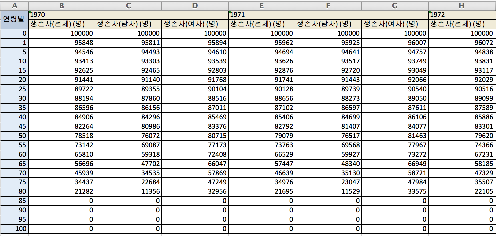
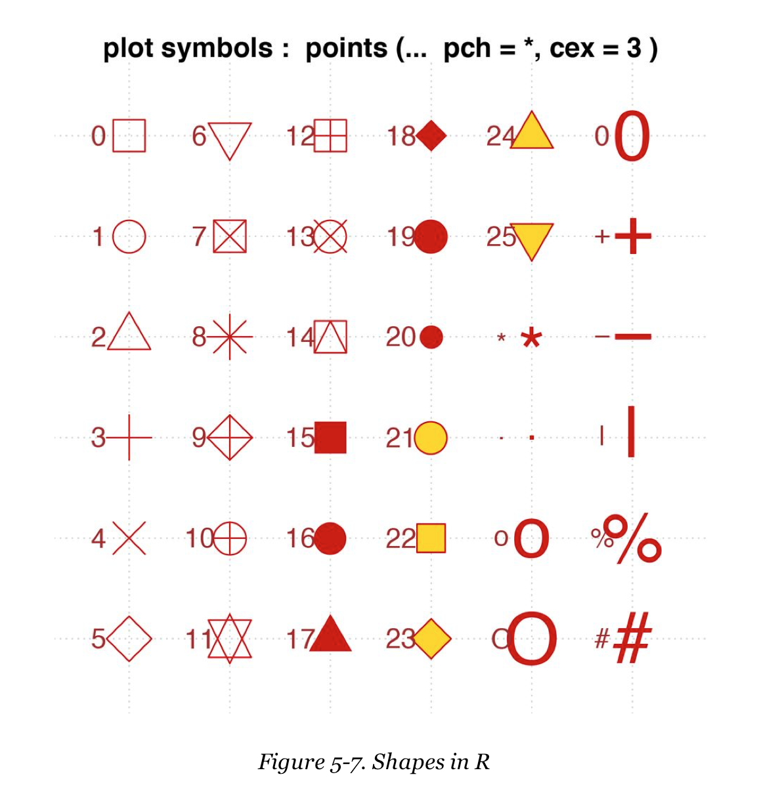

# Lifetable from 1970 to 2013 in Korea

## Data

From National Statistics Office, download excel format data, and manipulate it for a long time. 5 year interval, but enough to check the changes 

<!---->


```{r, data setup with xlsx, echo = FALSE, message = FALSE, results = 'hide'}
# install.packages("xlsx", repos = "https://cran.rstudio.com")
library(xlsx)
lt.kr.70.13 <- read.xlsx("../data/lifetable_kr.xlsx", 1, startRow = 3, endRow = 24, colIndex = 1:133, header = FALSE)
str(lt.kr.70.13)
gender.yr <- paste(c("A", "M", "F"), rep(1970:2013, each = 3), sep = "")
options(width = 180)
names(lt.kr.70.13) <- c("age", gender.yr)
str(lt.kr.70.13)
```

```{r, gender and year, echo = FALSE}
library(knitr)
check.10 <- cbind(head(gender.yr, n = 10), tail(gender.yr, n = 10))
dimnames(check.10)[[2]] <- c("First 10", "Last 10")
kable(check.10, caption = "Gender with Year")
# library(pander)
# panderOptions("table.split.table", Inf)
# pander(check.10)
```

## Plot

Compare the survival function plots of 1970 and 2013

```{r, survival function plots, fig.width = 12, fig.height = 6.75, echo = FALSE}
plot(A2013 ~ age, data = lt.kr.70.13, type = "b", ann = FALSE, xaxt = "n", yaxt = "n")
lines(A1970 ~ age, data = lt.kr.70.13, type = "b")
axis(side = 1, at = lt.kr.70.13$age, label = lt.kr.70.13$age)
axis(side = 2, at = seq(0, 100000, by = 25000), labels = seq(0, 100, by = 25))
main.title <- "Survival Function, 1970 vs 2013"
x.lab <- "Age (Years)"
y.lab <- "Proportion of Survival (%)"
title(main = main.title, xlab = x.lab, ylab = y.lab)
text(x = c(60, 82), y = c(52000, 80000), labels = c(1970, 2013))
```

## Difference of life expectancies

<!--### Coordinates for Polygon-->

```{r, polygon coordinates, echo = FALSE}
poly.kr.x <- c(lt.kr.70.13$age, rev(lt.kr.70.13$age))
poly.kr.y <- c(lt.kr.70.13$A2013, rev(lt.kr.70.13$A1970))
poly.kr <- data.frame(x = poly.kr.x, y = poly.kr.y)
```

<!--### Shading-->

Use shading to specify the difference

```{r, polygon, fig.width = 12, fig.height = 6.75, echo = FALSE}
plot(A2013 ~ age, data = lt.kr.70.13, type = "b", ann = FALSE, xaxt = "n", yaxt = "n")
lines(A1970 ~ age, data = lt.kr.70.13, type = "b")
axis(side = 1, at = lt.kr.70.13$age, label = lt.kr.70.13$age)
axis(side = 2, at = seq(0, 100000, by = 25000), labels = seq(0, 100, by = 25))
main.title <- "Survival Function, 1970 vs 2013"
x.lab <- "Age (Years)"
y.lab <- "Proportion of Survival (%)"
title(main = main.title, xlab = x.lab, ylab = y.lab)
text(x = c(60, 82), y = c(52000, 80000), labels = c(1970, 2013))
polygon(poly.kr, angle = 45, density = 15, col = "grey", border = NA)
```

<!--## Compare the areas -->

<!--`source` the `area.R()` function that was `dump()`ed. -->

```{r, area, echo = FALSE}
source("area.R")
options(digits = 3)
s.2013 <- area.R(lt.kr.70.13$age, lt.kr.70.13$A2013)/100000
s.1970 <- area.R(lt.kr.70.13$age, lt.kr.70.13$A1970)/100000
```

The area of the shaded region is `r round(s.2013 - s.1970, digits = 1)` (years).

## Changes in Life Expectancies by Gender

<!--In order to compute the genderwise life expectancies use `mapply()`. Fix `x = lt.kr.70.13$age` in `area.R(x, y)`, and extract the column indices from each column 

* Extracting column indices-->

```{r, index, echo = FALSE, results = 'hide'}
substr(names(lt.kr.70.13), start = 1, stop = 1)
A.idx <- substr(names(lt.kr.70.13), start = 1, stop = 1) == "A"
M.idx <- substr(names(lt.kr.70.13), start = 1, stop = 1) == "M"
F.idx <- substr(names(lt.kr.70.13), start = 1, stop = 1) == "F"
```

<!--* Use `mapply()`
    * Note how to define an `anonymous function`
    * Calculate life expectancies for each year
```{r, compute e0, echo = FALSE, result = 'hide' }
(A.e0 <- mapply(function(y) {area.R(x = lt.kr.70.13$age, y)}, lt.kr.70.13[, A.idx])/100000)
(M.e0 <- mapply(function(y) {area.R(x = lt.kr.70.13$age, y)}, lt.kr.70.13[, M.idx])/100000)
(F.e0 <- mapply(function(y) {area.R(x = lt.kr.70.13$age, y)}, lt.kr.70.13[, F.idx])/100000)
```
-->

## plots

<!--* Use `plot()` and `lines()`-->

```{r, 1970 to 2013, fig.width = 12, fig.height = 6.75, echo = FALSE}
Years <- 1970:2013
plot(Years, A.e0, type = "l", ylim = c(50, 90), ann = FALSE)
lines(Years, M.e0, col = "blue")
lines(Years, F.e0, col = "red")
main.title.2 <- "Changes in Life Expectancy"
x.lab.2 <- "Year"
y.lab.2 <- "Life Expectancy (Years)"
title(main = main.title.2, xlab = x.lab.2, ylab = y.lab.2)
legend("topleft", inset = 0.1, lty = 1, col = c("red", "black", "blue"), legend=c("Women", "All", "Men"))
```


# ggplot

<!--## Data Preparation

Put `reshape2` in the library to construct a long form data frame for `ggplot()` and apply `melt()`. Set up and another data frame composed of  `age`, `A1970`, `A2013`

```{r, data frame}
(lt.kr.df <- lt.kr.70.13[c("age", "A1970", "A2013")])
```

`library(reshape2)`, and , use `melt()` to transform into long form data frame

```{r, reshape2}
library(reshape2)
(lt.kr.melt <- melt(lt.kr.df, id.vars = "age", measure.vars = c("A1970", "A2013"), variable.name = "years", value.name = "lx"))
```
-->

## Plot

<!-- Compare survival function plots for 1970 and 2013 with `ggplot()`. What is the effect of the order of operation in `geom_point()` and `shape=21:22, fill="white"`-->

```{r, 1970 and 2013 ggplot, fig.width = 12, fig.height = 6.75, echo = FALSE}
library(ggplot2)
g.kr.1 <- ggplot() + 
  geom_line(data = lt.kr.melt, aes(x = age, y = lx/1000, colour = years))
g.kr.2 <- g.kr.1 + 
  geom_point(data = lt.kr.melt, aes(x = age, y = lx/1000, colour = years), shape = 21, fill = "white", size = 2) +
  theme_bw()
g.kr.3 <- g.kr.2 + 
  xlab(x.lab) +
  ylab(y.lab) +
  ggtitle(main.title) +
  scale_colour_discrete(name = "Years", labels = c("1970", "2013"))
g.kr.4 <- g.kr.3 +
  theme(legend.position=c(0.25, 0.25))
g.kr.4
```

<!---->

## Polygon

<!--Use `poly.kr`.-->

```{r geom_polygon, fig.width = 12, fig.height = 6.75, echo = FALSE}
p.kr.1 <- g.kr.4 +
  geom_polygon(data = poly.kr, aes(x = x, y = y/1000), alpha = 0.3, fill = "grey")
p.kr.2 <- p.kr.1 +
  geom_point(data = lt.kr.melt, aes(x = age, y = lx/1000, colour = years), shape = 21, fill = "white", size = 2)
p.kr.3 <- p.kr.2 + annotate("text", x = c(55, 63, 80), y = c(60, 78, 85), label = c("1970", "Difference of\nLife\nExpectancies", "2013"), colour = "blue")
p.kr.3
```

## Changes with respect to gender

<!--### Data reshaping-->
    
```{r, e0 melt, echo = FALSE}
lt.e0.df <- data.frame(year = 1970:2013, A = A.e0, M = M.e0, F = F.e0)
lt.e0.melt <- melt(lt.e0.df, id.vars = "year", measure.vars = c("A", "M", "F"), variable.name = "gender", value.name = "e0")
```

<!--### Changes in Life Expectancies-->

```{r, compare e0, fig.width = 12, fig.height = 6.75, echo = FALSE}
e0.1 <- ggplot(lt.e0.melt, aes(x = year, y = e0, colour = gender)) + 
  theme_bw() +
  geom_line() +
  geom_point(shape = 17, size = 2)
e0.2 <- e0.1 + 
  ylim(50, 90)
e0.3 <- e0.2 + 
  xlab(x.lab.2) + 
  ylab(y.lab.2) + 
  ggtitle(main.title.2)
e0.4 <- e0.3 + 
  labs(colour = "Gender") + 
  scale_colour_manual(values = c("black", "blue", "red"), labels = c("All", "Men", "Women"))
e0.5 <- e0.4 + 
  theme(legend.position = c(0.2, 0.8))
e0.5
```

<!--## Save

```{r, save}
save.image("lt_kr_160413.rda")
```
-->
